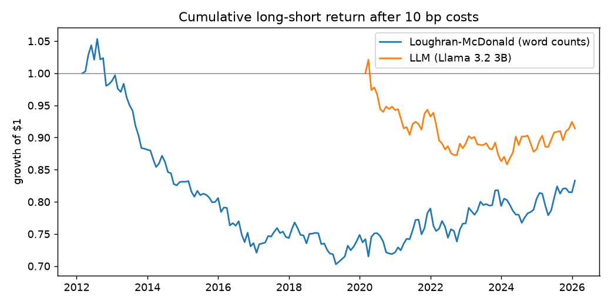

# Do LLM readings of 10-Ks predict stock returns?

When a company's annual report reads more pessimistic than the year before, as judged by a language model, does its stock underperform the next month? A Loughran-McDonald word count is the baseline.

**Answer: no.** Neither signal clears any bar below, and no robustness variant produces a significant IC (the word-count signal, 2022–2023 only, has a Sharpe ratio of 0.51 but an IC t-stat of −0.17). A memorization test finds no sign the model relies on remembering what happened to companies.

## Method

- **Universe:** historical S&P 500 members; every 10-K from SEC EDGAR, timed by its acceptance timestamp (when it became public).
- **Signals:** change versus the company's previous 10-K. LM: share of negative and uncertainty words. LLM (Llama 3.2 3B, local, temperature 0): pessimism = (hedging + risk severity − tone) / 3, from about 500 tokens of forward-looking MD&A text.
- **Backtest:** monthly, long the least-pessimistic quintile and short the most, equal-weighted, 10 bp per side; alpha against Fama-French 5 factors + momentum.

## Results

| | Loughran-McDonald (word counts) | LLM (Llama 3.2 3B) | Bar |
|---|---|---|---|
| Months held | 167 (2012-03 to 2026-01) | 71 (2020-03 to 2026-01) | |
| Mean monthly IC (t) | −0.005 (−1.02) | −0.001 (−0.19) | IC > 0.02, t > 2 |
| Sharpe ratio after costs | −0.22 | −0.30 | > 0.5 |
| Factor alpha, annualized (t) | −2.7% (−2.14) | 0.2% (0.17) | t > 2 |
| Deflated Sharpe ratio | 0.000 | 0.003 | > 0.95 |

## Memorization test

The LLM signal was recomputed with company names, tickers, people, products, dates and years masked, for every filing after the model's training cutoff (2023-12) and 500 before it. Filing-level IC (t):

| | Original text | Anonymized text |
|---|---|---|
| Before cutoff | −0.020 (−0.44) | −0.019 (−0.42) |
| After cutoff | 0.017 (0.51) | 0.010 (0.32) |

No cell differs from zero, and masking changes nothing (difference in differences −0.007, 95% interval −0.095 to 0.078). There is no performance for memorization to inflate; the test rules out only a large effect.

## Robustness

Sharpe ratio after costs (IC t-stat). Every variant is logged in `results/trials.csv` and counted by the deflated Sharpe ratio (18 trials).

| Variant | Loughran-McDonald (word counts) | LLM (Llama 3.2 3B) |
|---|---|---|
| Baseline: 1 month, 10 bp, equal-weighted | −0.22 (−1.02) | −0.30 (−0.19) |
| Costs 0 bp | −0.13 (−1.02) | −0.19 (−0.19) |
| Costs 25 bp | −0.36 (−1.02) | −0.47 (−0.19) |
| Value-weighted (public float) | −0.15 (−1.17) | 0.20 (0.04) |
| 3-month horizon | −0.19 (−1.06) | −0.39 (−0.74) |
| 2020–2021 only | 0.29 (0.94) | −0.58 (−0.68) |
| 2022–2023 only | 0.51 (−0.17) | −0.94 (−1.01) |

## Limitations

- Only 942 post-cutoff filings (23 months), so only a large effect would be detectable.
- A small model: its hedging score often contradicts its own written justification.
- Free Yahoo prices miss 14% of universe-months (mostly delisted companies), so results are likely optimistic.
- Anonymization is imperfect: some product names survive, and some companies are recognizable from their business.

## Next steps

1. Rescore with a larger model on a GPU (a config change; scores are cached per model).
2. Add 10-Qs to roughly quadruple the post-cutoff sample.
3. Use CRSP prices with delisting returns.
